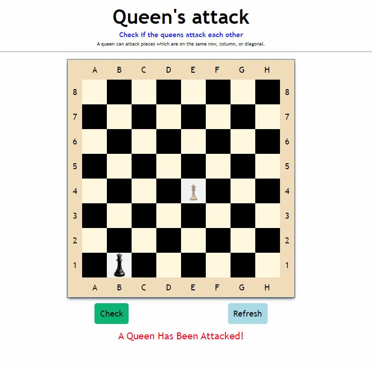

# Queen's Attack

## App

## About

This game game checks if two queens can attack each other. A queen can attack another when the are placed horizontally, vertically or at diagonals

## Play Game

Simply play the games by using your mouse pad. Click two any two squares on the chessBoard. Then, click the check button.

## Built With

- JavaScript
- CSS
- HTML

### Prerequisites

Knowledge about JS:

- Arrays
- Functions
- DOM Manipulation 

## Clone project

- To get a local copy up and running follow these simple example steps.
- Clone this repository with `git clone git@github.com:Ekep-Obasi/Queen-s-Attack.git` using your terminal or command line.
- Change to the project directory by entering: `cd Queen-s-Attack` in the terminal.

## Command line steps

- $ `git clone git@github.com:Ekep-Obasi/Queen-s-Attack.git`
- $ `cd Queen-s-Attack`
- $ `git checkout feature`

## Live Site

[Link](https://ekep-obasi.github.io/Queen-s-Attack/)

## Author

👤 **Ekep Obasi**

- GitHub: [@EkepObasi](https://github.com/Ekep-Obasi)
- Twitter: [@EkepObasi](https://twitter.com/ArreyEkep)

Optional items.

## 🤝 Contributing

Contributions, issues, and feature requests are welcome!

Feel free to check the [issues page](https://github.com/Ekep-Obasi/Queen-s-Attack/issues).

## Show your support

Give a ⭐️ if you like this project!

## 📝 License (optional)

This project is [RebaseAcademy](./LICENSE) licensed.